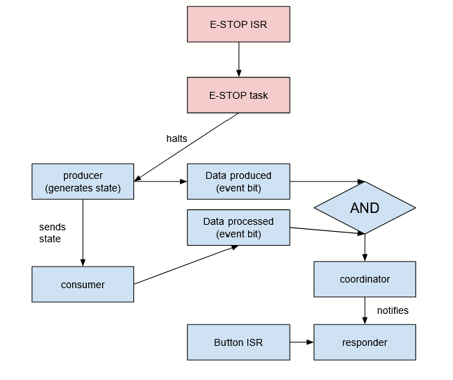

# Theme Park Ride Monitor — Real-Time Systems Final Capstone

## One sentence description
A safety critical system that simulates a ride's progression and emergency stops, built to demonstrate ride controls for a theme park engineering role.

## Demo
- Video: <YouTube>
- Wokwi URL: https://wokwi.com/projects/470898166033667073
- Live Wokwi: Rick-FINAL-RTS26Summer

## Architecture
  

In this system, the ride state is generated by the producer which feeds it to the consumer. Both the producer and consumer produce event bits which are checked by the coordinator, which then signals the responder. The blue button can also signal the responder, and the responder will give the current status of the ride. In an emergency, the red button can be clicked, triggering an emergency stop which suspends the producer, stopping the ride's progression. 

## Tasks & timing (WCET evidence)  

| Task | Function | Period (ms) | WCET (ms) | Deadline (ms) | Priority | Core |
| ---- | -------- | ----------- | --------- | ------------- | -------- | ---- |
| Producer | Produce the current ride status | 100 | 0.033 | 100 | 8 | 1 |  
| Consumer | Consume and display ride status from queue | 100 | 1.682 | 100 | 8 | 1 |  
| Coordinator | Check that both producer and consumer completed | 100 | 4.134 | 100 | 9 | 1 |  
| Responder | Display if ride is active or has stopped | Sporadic | 4.062 | 20 | 12 | 1 |  
| Emergency Stop | Halt the ride by suspending the producer | Sporadic | 1.576 | 10 | 15 | 1 |  

Utilization: 0.033 / 100 + 1.682 / 100 + 4.134 / 100 + 4.062 / 20 + 1.576 / 10  
Total utilization U = 0.42  (RM bound / EDF feasible: feasible under both)

## Hazard analysis & standard mapping
One instance of a hazard is that the emergency stop might be too slow, preventing the ride from stopping in time. This hazard is prevented in two ways. First, the priority of the emergency stop is above all other tasks at 15, as it is the most critical task. Second, the task completely suspends the producer, which generates new data. This prevents the ride from progressing further immediately when the emergency stop is called, making it faster.

## Graceful degradation
In this system, there is a web dashboard which displays the status of the ride and ride completion metrics. If the WiFi fails, the system will automatically switch to the serial display, which will display this information once per second, matching the functionality of the web display.

## Build & Run
The program was created entirely through Wokwi. To run on Wokwi, the program ZIP file can be uploaded as a new Wokwi project. This includes both the code and the board with wired components. Since the program generates a WiFi dashboard, WokwiGW must be downloaded from the Wokwi website for the user to run it. Before running the program, make sure WokwiGW is opened and leave it in the background. With the setup complete, run the program within Wokwi, and open localhost:9080 in the browser to view the web dashboard.

## Tailored for
This project is tailored for someone working in engineering in the theme park industry, likely in ride controls. The project was designed around maximizing safety, with fast emergency stops for hazardous scenarios. The project also involved including backup mechanisms incase of failures, which a controls engineer would need, as any accident on a ride could lead to serious injury.

## AI Disclosure
I used AI mainly through AI generated Google searches. These were mainly to understand some of the structures and functions available in FreeRTOS (like vTaskSuspend and vTaskResume), as well as understanding how to monitor the WiFi connection within Wokwi and the parameters that I would need.