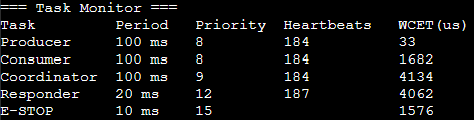

## Task Table

Using the WCET measurement tool from previous apps, I found the WCET for my system, which is shown below. .  

| Task | Function | Period (ms) | WCET (ms) | Deadline (ms) | Priority | Core |
| ---- | -------- | ----------- | --------- | ------------- | -------- | ---- |
| Load Task A | XORShift32 churn | 10 | 0.157 | 10 | 15 | 1 |  
| Button Task (Sem) | Track semaphore delay and log | - | - | - | 12 | 1 |  
| Load Task B | Single Precision FIR | 20 | 5.877 | 20 | 10 | 1 |  
| Load Task C | CRC-32 over a buffer | 50 | 5.751 | 50 | 5 | 1 |  
| Load Task D | Worst case insertion sort | 100 | 25.134 | 100 | 2 | 1 |  